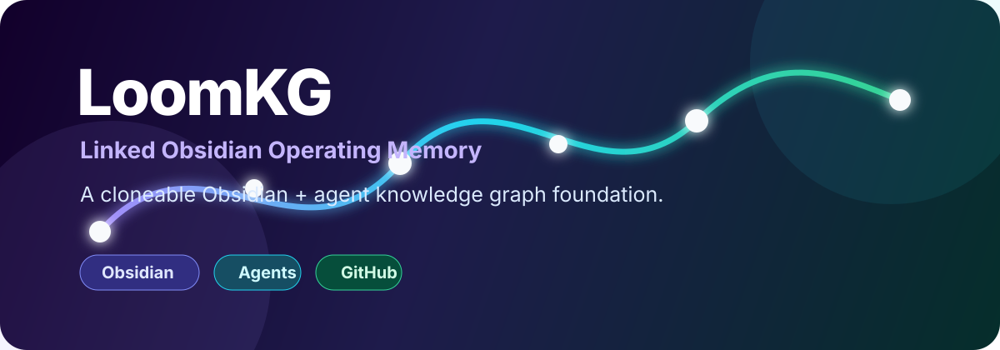

<div align="center">



# LoomKG

**Linked Obsidian Operating Memory**

A cloneable **Obsidian + agent knowledge graph foundation** that turns a starter folder into your own private, versioned, agent-maintained second brain.

[](LICENSE)


</div>

---

## Why LoomKG exists

Most AI chats forget. Most note vaults drift. Most project docs stay trapped in one repo.

LoomKG gives you a lightweight structure where an agent can steadily preserve reusable knowledge, decisions, sources, and context into a normal Markdown/Obsidian graph — then keep that graph backed up in your own private GitHub repo.

The public `loom-kg` repo is only the starter. Your living graph becomes yours.

## What you get

| Piece | Purpose |
|---|---|
| 🧠 Obsidian-ready vault | Open the cloned repo as a vault and browse the starter graph immediately. |
| 🤖 Agent setup guide | `AGENTS.md` gives Hermes, Claude Code, Codex, or another agent a deterministic setup flow. |
| 🧩 Templates | Starter shapes for concepts, decisions, theses, systems, indexes, and tombstones. |
| 🏷️ Registries | Controlled properties, types, domains, and tags so the graph stays queryable. |
| ✅ Validator | Checks schema, wikilinks, duplicate IDs, and reachability from the root index. |
| 🔐 GitHub-first workflow | Re-homes the starter into the user's own private repo for backup and history. |
| 🔁 Global capture rule | Helps the user's agent remember to ask about notes/tasks after useful work. |

## Five-minute start

1. Install Obsidian:
   - https://obsidian.md/download
2. Clone LoomKG:

```bash
git clone https://github.com/gl00mt1t4n/loom-kg.git
cd loom-kg
```

3. Open Obsidian.
4. Choose **Open folder as vault**.
5. Select the cloned `loom-kg` folder.
6. Optional but recommended: enable showing unsupported/all file extensions in Obsidian so files like `scripts/validate_vault.py` are visible.
7. Ask your agent:

```text
Read AGENTS.md and help initialize this LoomKG vault for me.
```

That is enough to see the starter structure. Obsidian vaults are just normal folders of Markdown files.

## Recommended tools

| Tool | Link | Why |
|---|---|---|
| Obsidian | https://obsidian.md/download | Human UI for the Markdown knowledge graph. |
| Git | https://git-scm.com/downloads | Local version control. |
| GitHub | https://github.com | Private cloud backup/versioning for the user's living graph. |
| GitHub CLI | https://cli.github.com | Lets the setup agent create the user's private repo and push automatically. |
| Hermes Agent | https://hermes-agent.nousresearch.com/docs | Recommended agent runtime because it supports skills, memory, tools, and scheduled work. |
| Claude Code | https://docs.anthropic.com/en/docs/claude-code | Works through the `CLAUDE.md` shim and `AGENTS.md`. |
| Linear | https://linear.app | Optional task layer for actionable work; LoomKG stores durable knowledge. |

Hermes is recommended, not required. LoomKG is written so any competent coding agent can read `AGENTS.md` and perform the setup.

## What the agent does after setup answers

The questions in [[AGENTS]] all include defaults. You can answer only what you care about; omitted answers use defaults.

After you answer, the agent should:

1. resolve defaults for unanswered questions
2. show a compact setup checklist
3. customize domains, tags, root index, and selected integrations
4. install any approved global knowledge-capture rule into the agent's global instruction/memory layer
5. run validation
6. ask whether you are happy with the foundation
7. create/re-home the private GitHub repo if approved
8. commit and push the initialized knowledge graph

## GitHub-first personal vaults

Every user's living KG should track their own private GitHub repo.

Default private repo name:

```text
<github-user>kg
```

Default re-home flow:

```bash
gh repo create <your-user>/<your-user>kg --private --description "Personal LoomKG knowledge graph" || true
git remote rename origin template-upstream
git remote add origin https://github.com/<your-user>/<your-user>kg.git
git push -u origin main
```

Result:

- `origin` points to the user's private knowledge graph repo.
- `template-upstream` points to the public LoomKG starter for intentional future comparison.
- normal `git push` goes to the user's private repo.

If the user wants no connection to the starter repo, the setup agent can remove `.git` and initialize a fresh repository instead.

## What belongs in LoomKG

Use LoomKG for durable knowledge:

- concepts and explanations
- source distillations
- decisions and why they were made
- falsifiable theses and invalidation conditions
- system/workflow notes
- tombstones for dead ends or superseded ideas
- cross-session context that future agents should recover

Do not use LoomKG for:

- raw chat dumps
- transient todos
- credentials or tokens
- private runtime config
- copied sources without synthesis
- task status that belongs in a task system

## Architecture at a glance

| Layer | Role |
|---|---|
| Obsidian | Human browsing, linking, graph view, and editing. |
| Markdown files | Durable, portable source of truth. |
| Frontmatter | Controlled metadata for types, domains, tags, and links. |
| Wikilinks | Explicit graph edges. |
| Templates | Consistent note creation. |
| Validator | Mechanical sanity checks. |
| Agent instructions | Repeatable setup and maintenance behavior. |
| GitHub | Private backup, history, and recovery. |

Start with:

- [[Root Index]] — root graph entrypoint.
- [[Graph Architecture]] — compact system model and invariants.
- [[Registries/Properties|Properties]] — approved frontmatter schema.
- [[Registries/Tags|Tags]] — approved broad tags.
- [[Templates]] — note templates.
- [[Skills]] — agent skill/instruction inventory.
- [[AGENTS]] — setup and maintenance instructions for agents.

## Validation

Run from the vault root:

```bash
python scripts/validate_vault.py .
```

The validator checks that:

- every normal Markdown file has required frontmatter
- type/domain/tag values match the registries
- wikilinks resolve
- IDs/aliases do not collide
- every normal Markdown file is reachable from [[Root Index]]
- external corpora are excluded from the personal graph

## External corpora

LoomKG does not include Hikari or any other external knowledge base by default.

If the user wants Hikari or another reference corpus, the setup agent should add it as a detached external folder/submodule, exclude it from validation, and avoid writing personal notes inside it.

## License

LoomKG is released under the MIT License. See [`LICENSE`](LICENSE).

## Public starter policy

This repository is the starter kit. A living personal knowledge graph should become the user's own private repository after setup.

Do not blindly merge future LoomKG changes into a living vault. Compare manually and copy only the improvements you want.
